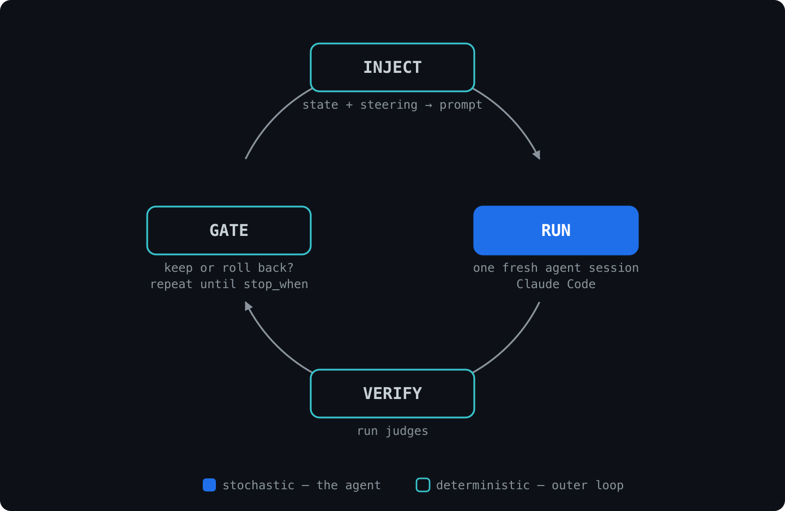
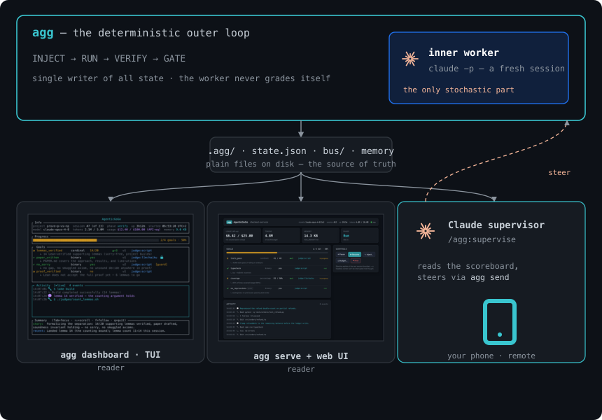
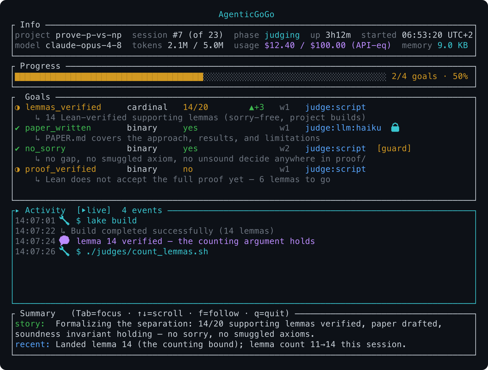
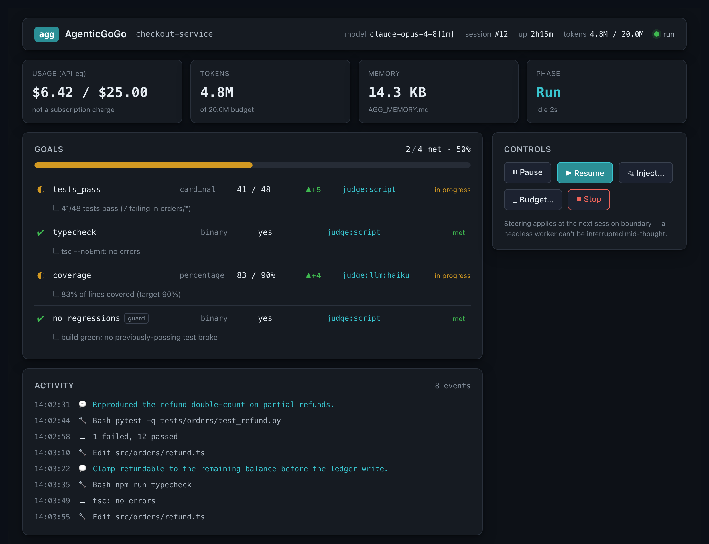

<h1 align="center">
  <br>
  AgenticGoGo
</h1>

<p align="center">
  <em>A deterministic outer Ralph loop with incorruptible judges around a stochastic inner agent.</em>
</p>

<p align="center"><em>Stop typing “go go”.</em></p>

---

Are you constantly typing **“go go”**, **“continue”**, **“keep going”** to nudge your coding agent
through a long plan? Do even spec-driven approaches stall mid-flight, run out of context, or
quietly stop one step short — leaving you to babysit a terminal?

**Then AgenticGoGo is for you.**

AgenticGoGo (`agg`) is a deterministic outer **[Ralph loop](https://ghuntley.com/ralph/)** that
drives a stochastic inner agent — relaunching a **fresh** session, verifying its work against gates
*it can't fake* (the **judges**), and repeating until your goals are actually met. The loop is plain code: it never hallucinates a decision. The agent does the work, inside one step, and never decides when it's done. *(A similar LLM-based approach — generate → verify → keep, as in evolutionary code search — was
proposed years ago, outside the Ralph-loop community, by DeepMind's
[AlphaCode](https://arxiv.org/abs/2203.07814) and its open-source variant
[CodeEvolve](https://arxiv.org/abs/2510.14150).)*

A **judge** is a small, incorruptible check that decides whether one goal is met — usually a script
inspecting the artifact (tests, a compiler, a proof checker), or an LLM grading against a rubric. You
compose several with a boolean grammar (`and` / `or` / `not`, e.g. `outputs_two and tests_pass`) to
say exactly what "done" means.

> **So far, Claude Code only.** `agg` drives `claude -p` as its inner agent. No other coding agent is
> supported today. This will change in the future.

<p align="center">
  
</p>

| Stage | What it does | Who runs it |
|---|---|---|
| **`INJECT`** | Builds the agent's prompt: your standing instruction, what past sessions learned, any steering you queued. | code |
| **`RUN`** | Launches one **fresh** Claude Code session (`claude -p`). It edits files. It never decides whether it succeeded. | **the agent** |
| **`VERIFY`** | `agg` runs your **judges** itself. The agent is never asked to grade its own homework. | code |
| **`GATE`** | Keeps or rolls back the work, checks `stop_when`, carries state forward — or stops. | code |

Three of the four stages are deterministic code; only the `RUN` stage is a (stochastic) coding agent.
The loop continues until all goals are met — potentially for hours, days, weeks (watch your token
consumption 😉). Because the agent never runs `VERIFY`, it can't fake the gate that decides it's done.

The overall architecture is captured in the following diagram:

<p align="center">
  
</p>

The whole system is **the loop plus plain files**: `agg` drives one fresh worker and writes state to
`.agg/`; the TUI, the web UI, and a `/agg:supervise` Claude session you can reach from your phone all
just *read* those files (and the supervisor can *steer* via the bus). More on that in
[State and memory](#state-and-memory) and [Interfaces](#interfaces).

## Quick start

Say you have a project with a broken `calc.py` and you want it fixed:

```python
# calc.py — BROKEN on purpose
def add(a, b):
    return a * b            # bug: should be a + b

if __name__ == "__main__":
    print(add(1, 1))        # prints 1; should print 2
```

*(A deliberately trivial example — a one-line fix where `agg` buys you nothing over just doing it
yourself. It's here to show the mechanics; the real payoff is long, multi-hour work you'd otherwise
have to babysit.)*

**0 — Install.** The binary, then the `/agg:*` skills (inside Claude Code):

```bash
curl -fsSL https://raw.githubusercontent.com/ssenge/AgenticGoGo/main/install.sh | sh   # the agg binary
```
```
/plugin marketplace add ssenge/AgenticGoGo && /plugin install agg@agenticgogo           # the /agg:* skills
```

Full options (prebuilt binaries, from source, version pinning) →
**[docs/INSTALL.md](docs/INSTALL.md)**.

**1 — Prerequisite: Claude Code.** `agg` drives Claude Code headlessly, so make sure it's installed
and authenticated — `claude -p "hello"` should print a reply. A subscription or an API key both work.

**2 — Let Claude set up the loop.** Type `/agg:new` in Claude Code to turn *your*
definition of "done" into config. Point it at a spec you already have (a PRD, ROADMAP, README,
`.planning/`), or just say what you want in the chat or directly as a parameter to the skill — e.g.

> `/agg:new` — done = `python3 calc.py` prints `2` **and** `pytest -q` passes

It reads that plus your code, shows the `goals.yaml` it proposes, and lets you edit before writing it
into `agg/`. The result might look like:

```yaml
# agg/goals.yaml — what "done" means, and who decides
goals:
  - id: outputs_two          # behaviour: the program actually prints 2
    type: binary
    judge: { kind: script, cmd: "./agg/judges/outputs_two.sh" }
  - id: tests_pass           # regression safety: the whole suite is green (a built-in judge)
    type: binary
    judge: { kind: script, cmd: "AGG_CMD='pytest -q' ${CLAUDE_PLUGIN_ROOT}/judges/cmd_exit.sh" }
stop_when: outputs_two and tests_pass
```

```yaml
# agg/agg.yaml — how the loop runs
project: calc
model: claude-sonnet-5
resume_prompt: AGG_RESUME.md
```

`AGG_RESUME.md` is the standing instruction `INJECT`ed into *every* session — "fix `calc.py` so
`python3 calc.py` prints 2 and the tests pass". In case of multiple iterations (i.e. multiple subsequent **`RUN`** stages), this file gets adapted to track the progress so far accordingly (see [State and memory](#state-and-memory)).
Also note the `stop_when: outputs_two and tests_pass` line in the `goals.yaml` file: it composes two judges with an `and`, and the next step explains how to create such judges.

**3 — Have Claude write the judge.** A judge is any command that prints a verdict as JSON (see
[Building judges](#building-judges)). You can write one by hand, but asking Claude is the easy way:

> **Prompt:** Write the judge `agg/judges/outputs_two.sh`: run `python3 calc.py`, print `{"met":true}` if its
> output is exactly `2`, else `{"met":false,"rationale":"calc.py did not print 2"}`. Nothing else on
> stdout.

The result might look like:

```bash
#!/usr/bin/env bash
# agg/judges/outputs_two.sh — VERIFY. agg runs this; the agent never does.
[ "$(python3 calc.py 2>/dev/null)" = "2" ] \
  && echo '{"met":true}' \
  || echo '{"met":false,"rationale":"calc.py did not print 2"}'
```

The second goal, `tests_pass`, needs no writing — it's a **built-in** judge (`pytest -q` must exit 0).
The `stop_when: outputs_two and tests_pass` line above requires **both**. Why chain them? Each catches
what the other misses: `outputs_two` alone is gameable — the agent could just hardcode `print(2)` —
but `tests_pass`, which checks `add(2, 3) == 5`, would still be red. That `and` is judge chaining:
any boolean of goal ids (`and` / `or` / `not`, with parentheses) is a valid `stop_when`.

**4 — Run it, and watch.**

```bash
agg plan                # dry run: one VERIFY pass, prints the scoreboard. No agent launched.
agg run --detach        # drive the loop until stop_when is met; logs to .agg/run.log
agg dashboard           # live TUI  (or: agg serve + the web UI — see Interfaces)
```

`VERIFY` rejects the broken `calc.py` → the agent fixes `a * b` → `a + b` → `VERIFY` re-runs both
judges → `GATE` sees `stop_when` met → the loop stops. This toy finishes in a **single iteration**,
and there's no knob to force more — the loop stops the moment `stop_when` is true. Real projects run
as many iterations as it takes to satisfy every goal, sometimes hundreds, each a fresh session.

**5 — Optionally, supervise from a second Claude Code session.** Start Claude Code **in the same
project folder** and run `/agg:supervise`. It's not required — a plain session could read the state
and run `agg send` too — but the skill hands that session the right playbook: read the compact
scoreboard (never the worker firehose, which would blow up your token bill), the steering vocabulary,
and what to watch for. Because you can reach that session from the Claude Code mobile app, you can
even check in and course-correct from your phone:

```
/agg:supervise
> how's it going?
> inject: the auth refactor is the blocker — do that first
```

The supervisor reads only `.agg/state.json` — the small scoreboard snapshot — and `agg status`. It
**never** tails the workers' output, so supervising a long run costs you almost nothing.

## Steering a running loop

You can't interrupt a headless agent mid-thought (a platform limit), so steering is
**session-granular**: queued on a bus, applied at the next `INJECT`.

```bash
agg send inject "focus on the auth module; it's the blocker"
agg send budget 8000000        # change the token ceiling mid-run
agg send pause                 # …and `agg send resume`
agg stop "done for today"      # graceful stop at the next GATE
```

Or skip the exact commands: tell your `/agg:supervise` session in plain English — *"inject: focus on
the auth module", "raise the budget to 8M", "pause for now"* — and it runs the right `agg send` for
you.

`Ctrl-C` or `agg stop` shuts the agent and the loop down cleanly — no orphaned worker, ledger
finalized, base branch untouched.

## Building judges

A judge is any command that prints a **verdict** as JSON to stdout. Only `met` is required; the rest
are optional:

```jsonc
{
  "met":       true | false,   // required — did this goal pass?
  "value":     <number>,       // optional — a count or percent (drives the progress bar)
  "max":       <number>,       // optional — the denominator for value
  "target":    <number>,       // optional — the value that counts as "done"
  "rationale": "<one line>",   // optional — shown on the dashboard
  "evidence":  ["<line>", ...] // optional
}
```

So a `binary` goal can print just `{"met": true}`; a cardinal one might print, as **one** example:

```json
{"met": false, "value": 18, "max": 28, "target": 28, "rationale": "18/28 tests pass"}
```

`agg` uses the last JSON object on stdout, so a judge can log freely and print its verdict last.

**Two flavours, same contract.** Judges are typically deterministic **scripts** or **LLM-as-judge** —
and to `agg` there's no difference: anything that emits the verdict JSON is a judge (a `script` judge
can even shell out to `claude -p` itself). The built-in **`llm`** kind is a convenience that also
*hardens* the LLM case against gaming. Give it a `rubric` + `inputs` + `model` and `agg`:

- **builds the prompt** — your rubric plus the declared input files, wrapped so the repo's content is
  fed as *untrusted data* the judge is told never to obey (a file can't talk the judge into a pass);
- **runs it isolated** — `--setting-sources user` (only *your* Claude settings, never the
  agent-mutated repo's `.claude/` config or hooks) and `--strict-mcp-config` (no MCP servers), so the
  agent can't steer the judge that grades it — and with no `--dangerously-skip-permissions`;
- **extracts the verdict** from the model's reply.

Ready-made script judges live in [`plugin/judges/`](plugin/judges/) (`cargo_test`, `cmd_exit`,
`grep_count`); rubrics in [`plugin/rubrics/`](plugin/rubrics/).

**Compose judges with Boolean grammar.** `stop_when` (and the optional `halt_when`) is any boolean of goal
ids — `a and b`, `a or b`, `not c`, with parentheses — so several judges together define "done":

```yaml
stop_when: outputs_two and tests_pass          # both must hold
halt_when: any_regressed(invariants) or over_budget   # optional guard — see docs/CONFIG.md
```

The rule that makes it a moat: **`agg` runs the judges, never the agent.** So make the judges check
the resulting artifacts — tests, a compiler, a proof checker — not the agent's claim about it — the agent will often enough hallucinate that a job is done.

## State and memory

`agg` keeps **no state in a database or a long-running daemon**. Everything is a plain file under
`<project>/.agg/` (gitignored), plus git itself. The loop is the single *writer*; every *reader* (the
TUI, the web UI, `/agg:supervise`, `agg status`) reads the same files — so you can attach any number
of views to a running loop without coupling any of them to it.

- **`.agg/state.json`** — the live scoreboard snapshot (goals, tokens, phase, activity tail), written
  atomically after each change. This is what the TUI, `agg serve`, and the supervisor read.
- **`.agg/run.pid`** · **`.agg/run.log`** — the loop's liveness (double-run guard, `agg stop` target)
  and its log when detached.
- **`.agg/bus/`** — the steering queue: `agg send …` writes a command here; the loop drains it at the
  next `INJECT`.
- **`.agg/sessions.count`** + run history (`agg history`) — counters that persist across every run.
- **`AGG_MEMORY.md`** (project root, committable) + **`.agg/memory/`** — durable cross-session memory
  the loop injects into every prompt.
- **git commits** — the actual *work* state. Each session commits; the next **fresh** session resumes
  from the filesystem + `AGG_MEMORY.md`, not from a held-open context. Git *is* the memory between
  sessions.

Because the log on stdout is the source of truth and `state.json` is just a view of it, a run is
**crash-safe and observable**: `tail`/`grep`/`cat` the files, kill and restart, inspect mid-run —
nothing important is hidden in process memory.

## Your Claude Code setup carries in

`agg` bundles no tools of its own. `RUN` is an ordinary `claude -p` call, so it **inherits your Claude
Code environment** — MCP servers, plugins, settings, and hooks all keep working inside the worker, and
`/agg:new` will even detect your active MCP servers / skills / hooks and offer to wire them into the
loop (via `hooks:` + `prompt_includes:`). Nothing is hardcoded; whatever your Claude Code has, the
worker gets.

Headless `-p` does impose real limits — worth knowing up front:

- **Slash-command skills aren't invocable** in `-p`. Inline the content you need into `AGG_RESUME.md`
  rather than calling `/some-skill`.
- **No mid-session interruption** (a platform limit), so steering is session-granular — queued on the
  bus, applied at the next `INJECT`.
- **The worker runs with full tool access** (`--dangerously-skip-permissions`), because a `-p` agent
  can't answer permission prompts. Narrow it with `worker_args` (e.g. `--allowedTools Edit,Bash`).
- **MCP servers that need interactive auth** (an OAuth login, say) may be unavailable in a headless run.
- The **judge & summarizer** sessions deliberately load *only your settings* — `--strict-mcp-config`
  (no MCP) and no repo `.claude/` — so the agent can't steer the process that grades it.

## Interfaces

Two ways to watch a run — same live state, two views — plus a chat supervisor:

<p align="center">
  
  
</p>
<p align="center">
  <sub><b>TUI</b> (<code>agg dashboard</code>) &nbsp;·&nbsp; <b>Web</b> (<code>agg serve</code> + the SvelteKit app in <code>web/</code>)</sub>
</p>

| | |
|---|---|
| **TUI** | `agg dashboard` — live scoreboard, goals, activity tail. `Tab` focus · `↑↓` `PgUp` `PgDn` `g` `G` scroll · `f` follow · `q` quit. `--once` prints a one-shot snapshot for CI/SSH. |
| **Web** | A standalone SvelteKit app in [`web/`](web/). The binary stays UI-free and exposes a thin JSON API. |
| **Supervisor** | `/agg:supervise` in a second Claude Code session — status and steering by chat, reachable from the mobile app. Reads the snapshot only, not the workers' output. |

```bash
agg serve                              # JSON API on :7878
cd web && npm install && npm run dev   # the web tool on :5173
```

## CLI reference

Global flags, valid on every subcommand: `--dir <path>` (project root, default `.`),
`--config <file>` (default `<dir>/agg.yaml`), `--goals <file>` (default `<dir>/goals.yaml`).

| Command | What it does | Flags |
|---|---|---|
| `agg init` | Scaffold **placeholder** config you must then edit — a blank-slate fallback. Prefer `/agg:new`, which fills it in from your project. | `--force` overwrite · `--folder` scaffold into `agg/` |
| `agg doctor` | Diagnose the setup: claude on PATH, config parses, conditions valid | |
| `agg plan` | Run every judge once and print the starting scoreboard (a dry run) | |
| `agg run` | Drive the loop until `stop_when` is met (or a guard fires) | `--max-sessions <n>` (0 = unlimited) · `--detach` / `-d` |
| `agg judge <id>` | Run **one** goal's judge and print its raw verdict — for authoring judges | |
| `agg status` | The loop's latest scoreboard, from its snapshot (cheap; re-runs no judges) | `--json` |
| `agg history` | This project's run history, newest first, plus lifetime totals | `--json` |
| `agg dashboard` | Live TUI | `--once` one-shot text snapshot |
| `agg serve` | JSON API for the web UI: `/api/state`, `/api/history`, `/api/health`, `POST /api/send` | `--port <n>` (7878) · `--cors-origin <url>` · `--token <t>` |
| `agg spawn` | *(used by the worker, not to start the loop)* track a long child task so the reaper spares it and the next session polls it | `--name <n>` · `--reason <why>` · `-- <cmd…>` |
| `agg stop [reason]` | Graceful stop at the next session boundary | |
| `agg inject <text>` | Prepend a high-priority instruction to the next session | |
| `agg pause` · `agg resume` | Hold the loop before the next session · continue a paused one | |
| `agg budget [total]` | Change the token ceiling (omit the value for unlimited) | |
| `agg send <cmd>` | The same steering, explicit: `inject`, `budget`, `pause`, `resume`, `stop`, `note` | |

`agg run` exit codes, so automation can branch on the outcome: **0** goals met (or an operator
stop) · **1** hard error · **3** a guard fired (`halt_when`) · **4** hit `--max-sessions`.

## Configuration

You don't normally write this by hand — `/agg:new` generates `agg/agg.yaml` and `agg/goals.yaml`
for your project, and `agg run` auto-detects the `agg/` folder. When you want to tune it: token and
dollar ceilings, the rolling summary, cross-session memory, per-session git isolation with a
rollback gate, lifecycle hooks, watchdog thresholds, goal types and the stop/halt condition DSL are
all documented in **[`docs/CONFIG.md`](docs/CONFIG.md)**.

## Examples

- **[`examples/hello-agg/`](examples/hello-agg/)** — the smallest possible loop, runnable in a
  minute, plus a walkthrough that drives a project to "all tests pass".
- **[`examples/p-vs-np/`](examples/p-vs-np/)** — the showcase: every feature aimed at one famous
  problem, with a Lean proof checker as the incorruptible judge.

## License

MIT
